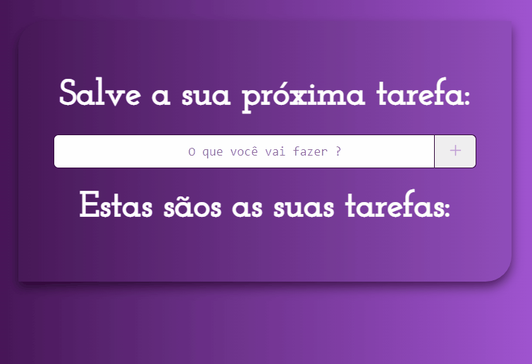

<h1 align="center"> Lista de Tarefas </h1>

Esse foi o projeto final referente a essa sequecia de estudos, teve outros projetos na 📁Projetos, más esse é o principal. Aqui vou por em pratica tudo que eu aprendi.

 

<h1 align = "center"> Apresentação ⬇️⬇️🔥💻</h1>
 

    

 

<h3>
➡️  Uma lista de tarefa aonde você pode ter uma ideia e digitar antes que esqueça e dando um CLICK em ➕ADD, vai está ficando salvo logo abaixo, aonde pode ter inúmeras tarefas salvas✅que se materão ali até você fazê-las. 
 
➡️  Assim que você cumprir a sua(as) tarefa(as), pode marcar com o checkmark✅. 
 
➡️  E para remover a tarefa que já foi realizada ou a que você não quer mais ser lembrado, pode da um CLICK em close❌ que vai ser apagada. 

</h3>  

# Recursos

-  [x] Digitar tarefas e add
-  [x] Remover tarefas adicionada
-  [x] Marcar como feita

<h1>Tecnologias 🤖💻</h1>

<h2>
    <ul>
        <li>✅HTML5</li>
        <li>✅CSS3</li>
        <li>✅JAVA-SCRIPT</li>
        <li>✅IONIC</li>
    </ul>
</h2>

made by me 👽  <a href="https://www.linkedin.com/in/jailson-silva-b528021b8/">My Linkedin</a> <small>Jailson Silva©</small> 

